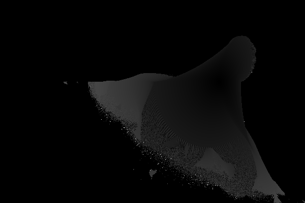

# FractalZoomer
*FractalZoomer* is an interactive tool that enables users to explore and visualize fractals images. The application is built with **Python**, **Numpy** and **Tkinter**. 
Explore the infinite beauty of mathematics visualizing your favorite shape choosing from Mandelbrot set, Julia sets, and the Burning Ship fractal and export your favorite images.

---

For more information about the project click [`here`](https://unibo-dtm-se-2425-fractalzoomer.github.io/report/)!

---

## Features
- **Three Fractal Types**: Mandelbrot, Julia (with variations), and Burning Ship sets
- **Interactive Navigation**: Click to zoom in/out, drag to pan
- **Julia Set Customization**: Choose from Dendrite, Dragon, Spiral, and more and personalize your own Julia shape
- **Adjustable Iterations**: Control detail level with custom iteration
- **Image Export**: Save your fractal explorations as images in your local device choosing from several supported formats such as JPG, PNG or BMP

---

## Project Structure
```bash
fractalzoomer/
├── src/
│   └── fractalzoomer/          # Main package
│       ├── __init__.py         # Package marker
│       ├── core/               # Fractal computation engines
│       │   ├── __init__.py
│       │   ├── base.py         # Abstract base class for fractals
│       │   ├── mandelbrot.py   # Mandelbrot set implementation
│       │   ├── julia.py        # Julia set implementation
│       │   └── burning_ship.py # Burning Ship fractal implementation
│       ├── ui/                 # User interface components
│       │   ├── __init__.py
│       │   ├── app.py          # Main Tkinter application
│       │   └── coordinates.py  # Coordinate transformation utilities
│       └── utils/              # Utility modules
│           ├── __init__.py
│           └── exporter.py     # Image export functionality
├── tests/                      # Unit tests
│   ├── __init__.py
│   ├── test_core.py            # Tests for fractal computations
│   ├── test_coordinate_mapping.py  # Tests for coordinate transformations
│   ├── test_exporter.py        # Tests for image export
│   └── test_parameter_julia.py # Tests for Julia parameter handling
├── .github/                    # GitHub CI configuration
│   └── workflows/
│       ├── check.yml           # Runs tests on multiple OS and Python versions
│       └── deploy.yml          # Automatic release to PyPI
├── LICENSE                     # License file (Apache 2.0)
├── pyproject.toml              # Project configuration (Poetry)
├── poetry.lock                 # Locked dependencies
├── requirements.txt            # Poetry installation
├── renovate.json               # Renovate bot configuration
└── CHANGELOG.md                # Project change history
```

---

## Installation
The application supports python versions from 3.11+, and it is stable up to the latest version.
The user can install the game directly from *GitHub* as follows

---

### PyPI Installation:
```bash
pip install fractalzoomer
```

---

### GitHub Installation
#### 1. Clone the repository:
```bash
git clone https://github.com/your-username/fractalzoomer.git
```
#### 2. Navigate to the project directory
```bash
cd fractalzoomer
```
#### 3. Installation with poetry (recommended)
```bash
pip install poetry
poetry install
```

---

## Launch the software
### Using Poetry:

```bash
poetry run fractalzoomer
```

### Or using Python directly:

```bash
python -m fractalzoomer.ui.app
```

---

## Controls

| Key / Action | Description |
|--------------|-------------|
| **Left-click** | Zoom in (centered on click position) |
| **Right-click** / **Option+click** | Zoom out |
| **Ctrl+drag** | Pan the view |
| **Iteration slider** | Adjust maximum iterations |
| **Fractal type radio buttons** | Switch between Mandelbrot, Julia, Burning Ship |
| **Julia preset dropdown** | Select predefined Julia constants |
| **Julia c slider** | Fine-tune Julia parameters |
| **💾 Save Image** | Export current view as image |
| **🔄 Reset View** | Return to default view |

---

## Contributing

Pull requests are welcome! For major changes, please open an issue first to discuss what you would like to change.

Please make sure to:
1. Update tests as appropriate
2. Run the test suite before submitting
3. Follow the existing code style

---

## Authors

- **Luca Mambelli** – [luca.mambelli2@studio.unibo.it](mailto:luca.mambelli2@studio.unibo.it)
- **Diana Lastovetska** – [diana.lastovetska@studio.unibo.it](mailto:diana.lastovetska@studio.unibo.it)

---

## License

[Apache 2.0 License](https://www.apache.org/licenses/LICENSE-2.0.html)

---

## Examples
Here some examples of the creation made with the software


---

---
